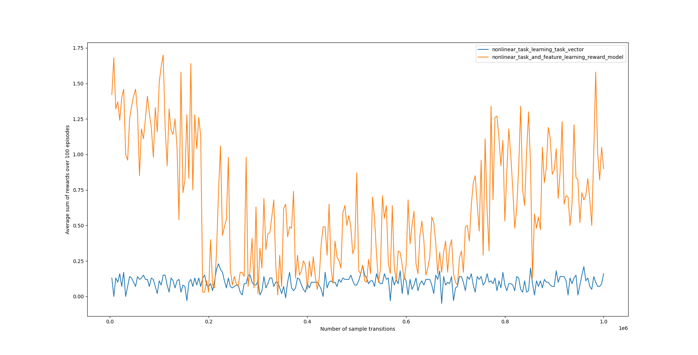

Welcome file
Welcome file

  

# Fast Reinforcement Learning
This is a repo where I implement the algorithms in the paper, [Fast reinforcement learning with generalized policy updates](https://www.pnas.org/content/pnas/117/48/30079.full.pdf). Thanks to Shaobo Hou and Andre Barreto for helping me out and answering some questions I had about the paper!

## Table of Contents
* [Background](#background)
* [Approach](#approach)
* [Reinforcement Learning Framework](#reinforcement-learning-framework)
* [Environment](#environment)
* [Fast Reinforcement Learning Framework](#fast-reinforcement-learning-framework)
* [Algorithms and Experiments](#algorithms-and-experiments)
* [Results](#results)
* [Expanding the Research Paper for Non-Linear Tasks](#expanding-the-research-paper-for-non-linear-tasks)
* [Future Work](#future-work)
* [File Descriptions](#file-descriptions)
* [Additional Resources](#additional-resources)

## Background
Reinforcement learning algorithms are powerful, especially paired with neural networks. They've allowed us to create AI agents that can solve complex games like Go and perform at a high level on visually rich domains like Atari games.

However, current reinforcement learning methods are very sample inefficient; they require a huge amount of training samples in order to learn to play at a reasonable level. To quote the paper: "in order to learn how to play one game of Atari, a simple video game console from the 1980s, an agent typically consumes an amount of data corresponding to several weeks of uninterrupted playing; it has been shown that, in some cases, humans are able to reach the same performance level in around 15 min".

Thus, there is motivation to find more sample efficient algorithms that require less training samples in order to reach a reasonable level of performance. This paper proposes some algorithms to address this problem.

## Approach
One hypothesis put forward as to why humans are able to learn a lot faster compared to today's AI algorithms, is because we can draw from our past experiences to help "jump-start" the learning process of a new task we haven't seen before; therefore requiring less experience and time to achieve a reasonable level of performance on a new task. This is with the assumption that some of the tasks we've learned to do in the past may share some similar characteristics and features with the new task at hand, and so we don't have to start from scratch when learning this new task.

In our early childhood years, we are faced with the task of developing motor control; learning how to crawl, stand, balance, walk and run. Learning these skills help us navigate and interact with the world we live in. When learning how to play a new sport like badminton for example, we can use the motor control skills we learned from these past tasks to help learn related, but more specialized footwork tasks in badminton; i.e. we don't have to re-learn how to walk to learn how to play a new sport. Additionally if we've previously played another racket sport like tennis, we've most likely learned some hand-eye coordination skills, which can also be applied to another racket sport like badminton, which may speed up the learning process even more.

In contrast, AI algorithms in general don't have the capability of re-using skills learned from past tasks. Every new task, the AI agent starts with a fresh clean state and has to learn from scratch. In the case of developing a robot that could play badminton, that would mean that the AI agent would have to learn how to stand and walk before even learning how to play the sport itself. If we were to create an algorithm that could allow the AI agent to draw from past experiences and leverage the skills it learned from past related tasks, perhaps it'll help the AI agent be more sample efficient and learn faster, like humans.

## Reinforcement Learning Framework

### Introduction

The traditional framework used for reinforcement learning contains two key concepts that are defined as such:
* an environment that encapsulates the domain of the problem we're trying to solve
* an agent that can make observations of the environment, perform actions to interact with the environment and receives rewards from the environment

(diagram can be found in Sutton and Barto's [book](http://incompleteideas.net/book/RLbook2020.pdf) as Figure 3.1 on page 48)

At every time step, the agent observes the environment state , and performs an action  which may alter the environment state, and then receives a transition reward . The objective of the agent is to maximize the reward received throughout the episode.

What determines what reward the agent receives and what state results from the agent's actions is the dynamics function. It's defined as , where given the current environment state  and an action  performed by the agent, outputs the probability that the new resulting environment state is  and that the corresponding transition reward is .

Thus, the dynamics function determines the "dynamics" of the environment; essentially the rules or laws that govern how the environment behaves and how the agent is rewarded.

### Tasks
In the traditional reinforcement learning framework described above, the agent's goal is to maximize the reward it receives. The reward is defined by the dynamics of the environment, and thus you could say that the reward dynamics determines the task the agent must optimize for.

For example, playing a zero-sum board game would have reward dynamics structured such that winning the game would result in receiving a positive reward, while losing the game would result in receiving a negative reward. Therefore given the dynamics of this environment, training an agent to maximize the reward received would essentially train the agent to optimize for the task of developing a strategy that allows it win as much as possible on this board game.

As mentioned before, agents typically train from scratch for every new task at hand. But in this paper, the authors develop a framework where agents are able to utilize skills it developed from past tasks, in order to help learn optimal strategies for tackling new tasks faster.

To do so, we must first formalize the definition of a task. A task, , defines what reward is received, when we arrive at a resulting state  after applying an action  on state . In the board game example, this could be performing some action  on the current board state  that leads to the game being over, and the resulting state  is the final state of the game. The task, , then tells us what reward is received as a result.

Therefore, the concept of tasks splits the dynamics function  (from the traditional reinforcement learning framework) into a separate reward dynamics function, , and transition dynamics function, . This separation allows us to have different tasks, ,  with potentially different reward dynamics, for an environment with the same transition dynamics.

To give some intuition why this might be helpful, we can go back to the badminton analogy. In badminton, different court lines are used to determine the boundaries of the court, depending on whether you are playing a singles or doubles game:

(image taken from the thumbnail of this [video](https://www.youtube.com/watch?v=KVr0Wzk1nAk))

The highlighted region shows the area of the court that's considered "in", while everything else is considered "out". Whether you're playing a singles game or doubles game, you are still subjected to the same laws of physics that govern our world; e.g. the way the birdie moves and the way that you interact with the physical world does not change based on which game format you're playing. Therefore, the transition dynamics for both the singles and doubles game format are the same.

What is different, however, are the reward dynamics. A birdie landing between the singles sideline and the doubles sideline would have a different result depending on the game format you're playing. If you're playing singles, it would be considered "out", whereas if you were playing doubles, it would be considered "in". Therefore even though the birdie landed in the same spot, the particular game format you're playing would determine whether you or your opponent would've scored a point. More generally, the same sequence of events (arriving at state  by performing action  on state ) can result in different rewards depending on the current task  at hand.

With badminton, it's not difficult to see that having past experience with one game format would help you learn the other game format much quicker compared to someone with no experience with badminton at all. The transition dynamics are the same in both formats, which means that the way the birdie moves and the way you interact with the world is the same. In addition, the two game formats are very similar, with only a slight difference in court boundaries. Therefore a lot of skills learned while playing one game format, will be relevant and useful when learning to play the other game format.

Therefore given the transition dynamics are the same, we can create a general algorithm that emulates this phenomenon. We can train an agent on a set of tasks, and allow it to utilize the skills it learned to help achieve a reasonable level of performance on a new task, in a relatively shorter amount of time than if it were to start from scratch. 

## Environment

(image taken from Fig. S1 a) on page 5 of the [supplementary information](https://www.pnas.org/content/pnas/suppl/2020/08/13/1907370117.DCSupplemental/pnas.1907370117.sapp.pdf) of the paper)

The environment used in the paper is a 10 by 10 grid with 2 different types of objects (represented by the red squares and blue triangles) occupying a total of 10 cells at a given time. The agent (represented by the yellow circle) can move up, down, left or right, and will automatically pick up objects if it moves to a cell occupied by one. Once an object is picked up by the agent, another object of a random type is randomly generated in one of the unoccupied cells in the grid.

## Fast Reinforcement Learning Framework

### Transition Feature Function
In the paper, the transition feature function  is introduced as a function that outputs a vector of transition features, based on arriving at a resulting state , after applying action  to state . These outputted transition features are a way of describing the transition dynamics for state-action sequences .

In the grid environment described above, for example, we could define a transition feature function  that outputs  if the agent picks up red square after applying action  to state ,  if the agent picks up a blue triangle after applying action  to state , and  otherwise. Such a function would describe the relevant transition dynamics for the state-action sequence , if we were interested in tasks that involved picking up these objects.

### Tasks
In the paper, the assumption is made that any reward function / task, , can be **linearly approximated** as such:

, 
where  is a transition feature function and  is a task vector of real numbers

Assuming the transition dynamics remain the same (and therefore, the transition feature function  stays the same), we can define different tasks with different reward dynamics for the agent, by changing the values of the task vector . If we were to use the transition feature function  described above, for example, one task could be to give a +1 reward to the agent every time it picks up a red square; in this case . Another task could be to give a +1 reward to the agent every time it picks up a blue triangle and give it a -1 reward every time it picks up a red square; in this case .

Given the assumption that the transition dynamics remain the same,   also remains the same, and therefore the task vector  essentially determines the task and the nature of the reward dynamics. Using the badminton analogy,  would describe where the birdie landed on the court, and  would describe whether you or your opponent would get the point; i.e.  would describe the task, or in this case, the game format.

### Successor Feature Function
In the paper, the successor feature function is defined as such:

, 
where  is a policy you're following,  is the discount factor, and  is a transition feature function

The successor feature function outputs the total expected discounted transition features the agent will accumulate over the course of the episode (or as the paper defines it, successor features), if it were to apply action  to the current state , and follow the policy  until termination. For example, if we're using the transition feature function  described above and  outputted a vector , then we can expect the agent to pick up a total of 5 red squares and 1 blue triangle if it were to apply action  to the current state  and follow policy  until termination of the episode. 

The successor feature function bares a resemblance to the definition of the action-value function, , defined (in Sutton and Barto's [book](http://incompleteideas.net/book/RLbook2020.pdf) as Equation 3.13 on page 58) as such:

, 
where  is a policy you're following,  is the discount factor, and  is the transition reward received at time 

The action-value function outputs the total expected discounted transition rewards the agent will accumulate over the course of the episode, if it were to apply action  to the current state , and follow the policy  until the termination of the episode.

Indeed when you take the dot product of the successor feature function  with a task vector , the definition of the action-value function is re-created, for a specific task vector :

In the original reinforcement learning framework, we obtain the transition reward  for arriving at the resulting state  after applying action  to the current state , from the dynamics function, . The dynamics function encapsulates both the transition and reward dynamics of the environment, which is sufficient if there is only one task we'd like the agent to optimize for.

In the fast reinforcement learning framework (under the assumption that the reward dynamics can be **linearly approximated** by the transition features), we first calculate the transition features  for arriving at the resulting state  after applying action  to the current state . Then we can separately dot product the transition features with a number of task vectors  to get the corresponding transition rewards for each task, , from the same transition features.

Therefore under the linear assumption, this new framework allows us to derive transition rewards from multiple tasks, from the same transition features, and therefore from the same state-action sequences . Later on, it will be evident why this property will be useful when leveraging policies learned from past tasks to help achieve a reasonable level of performance for a new task, in a relatively shorter amount of time than if it were to start from scratch.

### Generalized Policy
Suppose we train an agent on a variety of different tasks with different reward dynamics, to produce a set of learned action-value functions for each task . Now given a new task with different reward dynamics, the previously learned action-value functions in  would not be useful, as its predicted action-values are based on other tasks with different reward dynamics. That is to say, the original reinforcement learning framework doesn't allow us to leverage our knowledge of past tasks because the action-value function is only compatible with identical tasks with the same reward dynamics that that action-value function was trained on.

Now suppose we train an agent on a variety of different tasks with different reward dynamics, to produce a set of learned successor feature functions for each task  . Now given a new task vector with different reward dynamics, we can indeed use the previously learned successor feature functions and get the action-values for the new task, by taking the dot product between the two. This allows us to leverage our knowledge of past tasks to help guide the agent's decisions for a new task it hasn't seen before, in what is called the **generalized policy**.

More formally, the generalized policy is a function, , which given a state  and task vector , leverages a set of learned successor feature functions  to output an optimal action  to take.

(image taken from Fig. 3 of the [paper](https://www.pnas.org/content/pnas/117/48/30079.full.pdf))

For every successor feature function , for every action , the successor features are computed, and then dot producted with the task vector . The maximum action-value for each action is taken across all successor feature functions, and then the action that maximizes these action-values is returned. The generalized policy can be summarized in this equation:

Since the successor feature functions compute successor features rather than action-values, it is possible to compute new action-values using previously-learned successor feature functions on new tasks. This is in contrast with action-value functions, where the outputted values are based on the specific reward dynamics used when training that function.

### Generalized Policy - Badminton

Let's go back to the badminton analogy to gain some intuition on why the generalized policy may perform better than learning from scratch. Suppose we've trained an agent on both the singles and doubles format and have learned a corresponding successor feature function  and  for each. Let's define the successor feature functions to output a vector of size 13 that denote the number of times a birdie will land on the corresponding region of the opponent's side of the court (as displayed in the diagram below) if the agent follows the policy until the end of the game:

Therefore if the agent learned the game formats properly, we should expect  to output lower counts for regions 1, 3, 4, 7, 8 and 11, compared to , as those regions are considered "out" in the singles format. We should also expect to see lower counts in regions 12 and 13 for both successor feature functions since those regions are considered "out" for both formats.

With the successor feature functions defined this way, we can then create tasks for each corresponding format, with a +1 reward if the birdie landing in that region is considered "in", and a -1 reward if the birdie landing in that region is considered "out".

When playing either format, the agent can use the generalized policy to help decide what optimal action to take: 

In these cases, we would trivially expect that using the policy derived from  would outperform  for the task vector , and that the opposite would be true for the task vector . However the real power of this fast reinforcement learning framework, comes when the agent is given a task it hasn't seen before. Let's define a new game format as such:

 

Under the original reinforcement learning framework, we would have to retrain the agent to learn a new action-value function  from scratch, because the new game format has different reward dynamics compared to the action-values predicted by  and . However under the fast reinforcement learning framework, the successor feature functions we learned for the singles and doubles format can be used by the generalized policy to determine the optimal action to take for the new task:

Intuitively, we can interpret the generalized policy in this case as leveraging the agent's knowledge and skills developed from playing the singles and doubles format (e.g. which shots result in the birdie landing in certain regions of the court) to determine what  are the best actions to take under the new game rules.

### Generalized Policy - Grid World Environment
Applying the generalized policy is identical in the grid world environment specified in the paper. If the agent's been trained on a set of tasks to produce a set of successor feature functions, then the generalized policy for a new task , given the set of policies  derived from the learned successor feature functions, is defined as:

## Algorithms and Experiments
The paper outlines a series of experiments to test the fast reinforcement learning framework. 

### Q-Learning
Given a new task, we train the agent to learn an action-value function using Q-learning. The performance of the agent over time using this method of learning will be used as a benchmark to compare against the fast reinforcement learning framework methods.

The algorithm is as follows:
* For every training episode, for every time step in the episode, take the optimal action according to the action-value function or uniformly randomly sample an action according to an exploration parameter 
* Apply the selected action  to the current state  and observe the new resulting state  and transition reward 
* Update the action-value function according to this update rule:
	* 
	* 
	* where  is the action that maximizes the action-value at state  (i.e. ),  is the discount factor,  is the learning rate and  are the parameters of the action-value function 

* Periodically measure the agent's performance by averaging over 100 episodes the total reward it receives when greedily following its policy derived from the current learned action-value function 

### Hand-Coded Transition Feature Function
Given the hand-coded transition feature function  (as described above), we first train the agent to learn two successor feature functions for the two task vectors  and , using a modified version of Q-learning. We can then test the agent's performance on a new task it hasn't seen before, using its generalized policy, leveraged from the learned successor feature functions.

The algorithm to learn the successor feature functions is as follows:
* For every training episode, randomly pick one of the task vectors to train on
* For every time step in the episode, take the optimal action according to the corresponding successor feature function or uniformly randomly sample an action according to an exploration parameter 
* Apply the selected action  to the current state  and observe the new resulting state 
* Update the successor feature function according to this update rule:
	* 
	* 
	* where  is the action that maximizes the action-value at state  (i.e. ),  is the discount factor,  is the learning rate and  are the parameters of the successor feature function 

Note that the update rule is very similar to the update rule in regular Q-learning. Normally in regular Q-learning, the TD-error  is equal to the difference between the bootstrapped action-value target  and the predicted action-value .

In this case, rather than predicting action-values, we're predicting transition features. Therefore the TD-error  is equal to the difference between the bootstrapped transition features target  and the predicted transition features .

Once the successor feature function is learned for the two task vectors  and , we test the agent on a new task it hasn't seen before.

The algorithm for learning the new task vector and testing the agent's performance is as follows:
* Randomly initialize a vector  that will learn the reward dynamics of the new task
* For every training episode, for every time step in the training episode, uniformly randomly sample an action
* Apply the selected action  to the current state  and observe the new resulting state  and transition reward 
* Update the task vector  according to this update rule:
	* 
* Periodically measure the agent's performance by averaging over 100 episodes the total reward it receives when greedily following its generalized policy , given the current values of the learned task vector 

### Learned Transition Feature Function
When not given a hand-coded transition feature function, we can still use the fast reinforcement learning framework. However, we must first train the agent to learn a transition feature function  from the environment rewards based on a variety of task vectors , , , and . We can then have the agent used the learned transition feature function to learn two successor feature functions for the two task vectors  and , using a modified version of Q-learning. We can then test the agent's performance on a new task it hasn't seen before, using its generalized policy, leveraged from the learned successor feature functions.

The algorithm to learn the transition feature function is as follows:
* Randomly initialize a set of vectors  that will learn the reward dynamics of the new tasks
* For every training episode, for every time step in the episode, uniformly randomly sample an action
* Apply the selected action  to the current state  and observe the new resulting state 
* Update the transition feature model and the task vectors according to this update rule:
	* 
	* where  is the transition reward associated with task 

Once the transition feature function is learned, we can apply the same algorithms in the previous section to learn the successor feature function (except the agent will be using  instead of ) and then subsequently learn the new task vector. 

Note that the transition feature function  learned by the agent may not represent the transition features in the same way that the hand-coded transition feature function  does. Thus, the task vectors  and  used to learn the successor feature functions when using  versus using , may have different meaning. In the case of , the task vectors would represent giving a +1 reward to the agent if it picks up a red square or blue triangle respectively, and 0 otherwise. There is no guarantee that the same is true for .

Nevertheless, this potential discrepancy is inconsequential as it turns out that unit task vectors serve as a good enough basis to learn successor feature functions, regardless of what the task actually represents.

## Results
The agent was evaluated on a new task where a reward of +1 is given if the agent picks up a red square and a reward of -1 is given if it picks up a blue triangle, and 0 otherwise. This task corresponds to a task vector .

The total sum of rewards received by the agent averaged over 100 episodes is shown in the graph below:

Every 100 episodes, the agent is evaluated using its current model parameters (i.e. the action-value function for Q-learning and the generalized policy and the learned task vector for the fast reinforcement learning algorithms). Q-learning is represented by the blue line, fast reinforcement learning using a hand-coded transition feature function is represented by the orange line, and fast reinforcement learning using a learned transition feature function is represented by the green line.

As you can see, the fast reinforcement learning algorithms immediately perform much better than Q-learning, making the algorithms much more sample efficient. However there is no guarantee that the generalized policy is optimal (as it depends on the tasks the agent trained on when learning the successor feature function), and so eventually Q-learning outperforms the fast reinforcement learning algorithms after many sample transitions.

For comparison, here are the graphs for the same experiments found as Figure 5 A and B on page 6 of the paper:

## Expanding the Research Paper for Non-Linear Tasks
The paper describes a method to learn non-linear tasks by using a mapping, , that maps states to task vectors. The generalized policy is redefined as , and Q-learning is used to learn . 

For example, let's define a non-linear task as giving an agent a reward of +1 for picking up the most abundant object and a reward of -1 for picking up anything else. This can be modelled with  by outputting a task vector of  or  for either case, depending on the current state .

An alternative method of learning non-linear tasks is if we parameterize the reward function, , with a non-linear function approximator (e.g. neural networks) and have the agent learn the reward function from the environment rewards. The reward function, given transition feature inputs, would output the predicted transition reward.

The generalized policy using a learned reward function  can be summarized in this equation:

The algorithm to learn the transition feature function would then be as follows:
* Randomly initialize a set of reward functions  that will learn the reward dynamics of the new tasks
* For every training episode, for every time step in the episode, uniformly randomly sample an action
* Apply the selected action  to the current state  and observe the new resulting state 
* Update the transition feature model and the reward functions according to this update rule:
	* 
	* where  is the transition reward associated with task 

Four non-linear tasks were used to learn the transition feature function. The tasks are as follows:
* +1 reward is given to the agent if it picks up a red square and -1 reward is given if it picks up a blue triangle, 0 otherwise, if the count for each object type is even (and vice versa when the count is odd)
* +1 reward is given to the agent if it picks up a red square and -1 reward is given if it picks up a blue triangle, 0 otherwise, if the count for each object type is odd (and vice versa when the count is even)
* +1 reward is given to the agent if it picks up an object that is vertically aligned with another object in the grid world and +0.1 reward is given instead if there are no objects vertically aligned with the picked up object, 0 otherwise
* +1 reward is given to the agent if it picks up an object that is horizontally aligned with another object in the grid world and +0.1 reward is given instead if there are no objects horizontally aligned with the picked up object, 0 otherwise

Since both the transition feature function and the reward functions are approximated by neural networks, the parameters for all models can be trained jointly end-to-end via backpropagation, using the environment transition rewards as the targets. Intuitively, the transition feature function must learn to represent general enough transition features such that they can be useful as inputs for all of the reward functions  in order to approximate the transition rewards derived from the non-linear tasks.

Once the transition feature function  is learned, the same algorithm mentioned previously for learning the successor feature functions can be used.

The algorithm for learning the reward function for the new task and testing the agent's performance is as follows:
* Randomly initialize a reward function  that will learn the reward dynamics of the new task
* For every training episode, for every time step in the training episode, uniformly randomly sample an action
* Apply the selected action  to the current state  and observe the new resulting state  and transition reward 
* Update the reward function  according to this update rule:
	* 
* Periodically measure the agent's performance by averaging over 100 episodes the total reward it receives when greedily following its generalized policy , given the current parameters of the learned reward function 

For comparison, the previous experiment was conducted again on non-linear tasks. A transition feature function was learned by approximating the four non-linear tasks mentioned above using task vectors. The successor feature function was then learned from the learned transition feature function using unit basis task vectors, as before.

The non-linear task used for evaluation is as follows:
* give the agent a reward of +1 if it picked up the more abundant object,  and a reward of -1 if it picked up the less abundant object, and 0 otherwise.

The total sum of rewards received by the agent averaged over 100 episodes using the learned reward function is shown in the graph below:

Fast reinforcement learning using non-linear reward functions is represented by the orange line, and fast reinforcement learning using task vectors is represented by the blue line.

As you can see, the agent using the non-linear reward functions to approximate the transition rewards perform marginally better than the agent using task vectors. With some tweaking of the reward function's neural network hyperparameters and the choice and number of tasks used, there could be potential for this framework to perform even better.

Using a function approximator like a neural network to model the reward function theoretically allows this framework to generalize to the reward dynamics of any task, linear or non-linear. It is definitely worth exploring some more!

## Future Work
So far, the fast reinforcement learning framework allows the agent to use a generalized policy that draws from past experience, to make better actions than it would make if it started learning from scratch. 

But as we've seen, Q-learning will eventually outperform the generalized policy as Q-learning theoretically converges to an optimal policy, whereas there's no such guarantee for the generalized policy.

We've seen that the generalized policy's initial baseline performance is much better than Q-learning, where the agent is starting from scratch. Naturally, an extension of the algorithms put forth by the paper is to let the agent leverage the strong initial baseline performance of the generalized policy, while learning a new successor feature function for the current task at hand, using a modified version of Q-learning.

The algorithm would be as follows:
* Given a set of learned successor feature functions from previous tasks, , add a new, randomly initialized successor feature function  to the set for the new task
* Randomly initialize a reward function  that will learn the reward dynamics of the new task
* For every training episode, for every time step in the episode, take the optimal action according to the generalized policy  or uniformly randomly sample an action according to an exploration parameter 
* Apply the selected action  to the current state  and observe the new resulting state 
* Update the successor feature function according to this update rule:
	* 
	* 
	* where  is the action that maximizes the action-value at state  (i.e. ),  is the discount factor,  is the learning rate and  are the parameters of the successor feature function 
* Update the reward function  according to this update rule:
	* 

The same can algorithm can be applied to task vectors as well, in which we would just take the dot product of the transition features and task vector to get the predicted transition reward and action-values, instead of feeding it as inputs into the reward function.

This algorithm essentially adds the successor feature learning algorithm to the new task learning algorithm used in earlier experiments. As mentioned before, the new task learning algorithm was able to have decent performance due to the strong initial baseline performance given by the generalized policy. But the performance plateaus because there is no successor feature function being learned for the new task (only the reward dynamics of the new task are learned, either via a task vector or reward function). Adding a separate successor feature function allows it to learn a policy specifically for the new task, using a modified version of Q-learning. Thus, using the modified algorithm allows the agent to leverage the strong initial baseline performance of the generalized policy for the initial episodes of training, while asymptotically learning an optimal policy for the new task. 

We should expect to see a decent initial performance of the agent, similar to what we saw in previous experiments when it used its generalized policy. Over time, the successor feature function  will have its parameters updated and its corresponding action-values  will increase as the agent learns from the new task. Once  for all , for all , we should see the generalized policy improve beyond the plateau that we saw in previous experiments (although practically speaking, the generalized policy will improve incrementally even before this point, as  for an increasing amount of state-action-state triplets).

Another benefit is that using the generalized policy could lead to potentially better action selection compared to following a randomly initialized policy, for the initial episodes. Perhaps this strong initial baseline performance may lead to more sample efficient learning and therefore faster convergence to an optimal policy as well.

The only downside of this algorithm is that the agent must know that it is given a new task, so that it can instantiate a new corresponding successor feature function to learn the successor features and reward dynamics of the new task. This would be impossible if the agent were to use the current algorithm in hypothetical, non-stationary continuous environments, where the reward dynamics could change over time.

A possible solution to this is to set a hyperparameter , where every  sample transitions, the agent instantiates a new successor feature function to learn (and stops learning for the previous successor feature function). This would help it adapt to new reward dynamics, although it wouldn't be ideal as the change in environment reward dynamics may not coincide simultaneously with the instantiation of a new successor feature function. Nevertheless, it'll give the agent some level of adaptability.

The other issue is that if the environment is continuous, the space complexity for storing an ever-increasing amount of successor feature functions is intractably large. Therefore there may be a need to design a pruning mechanism to discard unneeded successor feature functions over time, to maintain a manageable amount of memory. Some possible pruning mechanisms could be:
* maintain the -most recent successor feature functions, and discard any that are older
	* this mechanism may work under the assumption that the most recent reward dynamics encountered by the agent in the environment are more relevant and useful
* keep a running count of how often each successor feature function, , is used in the generalized policy, and then over time discard the successor feature functions with the lowest count
	* a successor feature function, , is considered "used" by the generalized policy if it's corresponding action-value is the maximum out of all policies  and all actions  for the current state 
		*  i.e. 
	* this mechanism may work under the assumption that successor feature functions that are used more often by the generalized policy are more relevant and useful

Adding reward functions to approximate non-linear reward dynamics and adding successor feature function learning to the new task learning algorithm will give the agent the power to theoretically learn an optimal policy for any task. Adding a pruning mechanism to discard unneeded successor feature functions will give the agent the power to operate in a non-stationary, continuous environment, where the reward dynamics may change over time. The result is a sample efficient algorithm that can allow the agent to learn a variety of tasks in a variety of environments. I'm excited to see what other things we can do to improve the algorithm, as the more general we can make it, the more applicable it can be to the real world! 

## File Descriptions
* `q_learning.py` holds the training algorithm for Q-learning
* `sf_q_learning.py`holds the training algorithm to learn successor feature functions using a hand-coded transition feature function
* `task_learning.py` holds the training algorithm to learn a task vector on a new task, using the successor feature functions learned in `sf_q_learning.py`
* `task_and_feature_learning.py` holds training algorithms to learn a transition feature function, learn successor feature functions using the learned transition feature function, and then learning a task vector on a new task, using the learned successor feature functions
* `nonlinear_task_and_feature_learning_task_vector.py` holds the same training algorithms as `task_and_feature_learning.py`, except the agent trains on non-linear tasks instead of linear tasks
* `nonlinear_task_and_feature_learning_reward_model.py` holds the same training algorithms as `nonlinear_task_and_feature_learning_task_vector.py`, except the agent approximates the transition rewards using a reward function neural network, instead of task vectors
* `nonlinear_reward_functions.py` holds non-linear reward functions for the grid world environment
* `classes.py` holds data structure classes for the grid world environment and all neural network models
* `main.py` holds functions that run all of the training algorithms listed above
	* `run_linear_experiments` will run the training algorithms in `q_learning.py`, `sf_q_learning.py`, `task_learning.py` and `task_and_feature_learning.py`, on linear tasks
	* `run_nonlinear_experiments` will run the training algorithms in `nonlinear_task_and_feature_learning_task_vector.py` and `nonlinear_task_and_feature_learning_reward_model.py`, on non-linear tasks
* `models/` holds saved neural network models learned by the agent
	* `models/q_model.pkl` is the Q-learning function learned in `q_learning.py`
	* `models/sf_list.pkl` is the list of successor feature functions learned in `sf_q_learning.py`
	* `models/tf_model.pkl` is the transition feature function learned in `task_and_feature_learning.py`
	* `models/sf_list_with_learned_transition_features_of_dimension_2.pkl` is the list of successor feature functions learned in `task_and_feature_learning.py`
	* `models/nonlinear_tf_model_task_vector.pkl` is the transition feature function learned in `nonlinear_task_and_feature_learning_task_vector.pkl`
	* `models/nonlinear_sf_list_with_learned_transition_features_of_dimension_2_task_vector.pkl` is the list of successor feature functions learned in `nonlinear_task_and_feature_learning_task_vector.pkl`
	* `models/nonlinear_tf_model_reward_model.pkl` is the transition feature function learned in `nonlinear_task_and_feature_learning_reward_model.pkl`
	* `models/nonlinear_sf_list_with_learned_transition_features_of_dimension_2_reward_model.pkl` is the list of successor feature functions learned in `nonlinear_task_and_feature_learning_reward_model.pkl`
* `evaluation_data/` holds the evaluation data on the agent's performance on a new task over time as it trains
	* `classic_q_learning.pkl` is the evaluation data of the agent in `q_learning.py`
	* `task_learning.pkl` is the evaluation data of the agent in `task_learning.py`
	* `task_learning_with_learned_transition_features_of_dimension_2.pkl` is the evaluation data of the agent in `task_and_feature_learning.py`
	* `nonlinear_task_learning_with_learned_transition_features_of_dimension_2_task_vector.pkl` is the evaluation data of the agent in `nonlinear_task_and_feature_learning_task_vector.py`
	* `nonlinear_task_learning_with_learned_transition_features_of_dimension_2_reward_model.pkl` is the evaluation data of the agent in `nonlinear_task_and_feature_learning_reward_model.py`
* `assets/` holds media files used in this `README.md`
* `requirements.txt` holds all required dependencies, which can be installed by typing `pip install -r requirements.txt` in the command line

For this project, I'm using Python 3.7.11.

## Additional Resources
* [DeepMind fast reinforcement learning webpage](https://deepmind.com/blog/article/fast-reinforcement-learning-through-the-composition-of-behaviours)
* [A Youtube video of Doina Precup (one of the authors) explaining the paper](https://www.youtube.com/watch?v=6_7vE08acVM)
Fast Reinforcement Learning
This is a repo where I implement the algorithms in the paper, Fast reinforcement learning with generalized policy updates. Thanks to Shaobo Hou and Andre Barreto for helping me out and answering some questions I had about the paper!

Table of Contents
Background
Approach
Reinforcement Learning Framework
Environment
Fast Reinforcement Learning Framework
Algorithms and Experiments
Results
Expanding the Research Paper for Non-Linear Tasks
Future Work
File Descriptions
Additional Resources
Background
Reinforcement learning algorithms are powerful, especially paired with neural networks. Theyve allowed us to create AI agents that can solve complex games like Go and perform at a high level on visually rich domains like Atari games.

However, current reinforcement learning methods are very sample inefficient; they require a huge amount of training samples in order to learn to play at a reasonable level. To quote the paper: in order to learn how to play one game of Atari, a simple video game console from the 1980s, an agent typically consumes an amount of data corresponding to several weeks of uninterrupted playing; it has been shown that, in some cases, humans are able to reach the same performance level in around 15 min.

Thus, there is motivation to find more sample efficient algorithms that require less training samples in order to reach a reasonable level of performance. This paper proposes some algorithms to address this problem.

Approach
One hypothesis put forward as to why humans are able to learn a lot faster compared to todays AI algorithms, is because we can draw from our past experiences to help jump-start the learning process of a new task we havent seen before; therefore requiring less experience and time to achieve a reasonable level of performance on a new task. This is with the assumption that some of the tasks weve learned to do in the past may share some similar characteristics and features with the new task at hand, and so we dont have to start from scratch when learning this new task.

In our early childhood years, we are faced with the task of developing motor control; learning how to crawl, stand, balance, walk and run. Learning these skills help us navigate and interact with the world we live in. When learning how to play a new sport like badminton for example, we can use the motor control skills we learned from these past tasks to help learn related, but more specialized footwork tasks in badminton; i.e. we dont have to re-learn how to walk to learn how to play a new sport. Additionally if weve previously played another racket sport like tennis, weve most likely learned some hand-eye coordination skills, which can also be applied to another racket sport like badminton, which may speed up the learning process even more.

In contrast, AI algorithms in general dont have the capability of re-using skills learned from past tasks. Every new task, the AI agent starts with a fresh clean state and has to learn from scratch. In the case of developing a robot that could play badminton, that would mean that the AI agent would have to learn how to stand and walk before even learning how to play the sport itself. If we were to create an algorithm that could allow the AI agent to draw from past experiences and leverage the skills it learned from past related tasks, perhaps itll help the AI agent be more sample efficient and learn faster, like humans.

Reinforcement Learning Framework
Introduction
The traditional framework used for reinforcement learning contains two key concepts that are defined as such:

an environment that encapsulates the domain of the problem were trying to solve
an agent that can make observations of the environment, perform actions to interact with the environment and receives rewards from the environment
Alt text
(diagram can be found in Sutton and Bartos book as Figure 3.1 on page 48)

At every time step, the agent observes the environment state , and performs an action  which may alter the environment state, and then receives a transition reward . The objective of the agent is to maximize the reward received throughout the episode.

What determines what reward the agent receives and what state results from the agents actions is the dynamics function. Its defined as , where given the current environment state  and an action  performed by the agent, outputs the probability that the new resulting environment state is  and that the corresponding transition reward is .

Thus, the dynamics function determines the dynamics of the environment; essentially the rules or laws that govern how the environment behaves and how the agent is rewarded.

Tasks
In the traditional reinforcement learning framework described above, the agents goal is to maximize the reward it receives. The reward is defined by the dynamics of the environment, and thus you could say that the reward dynamics determines the task the agent must optimize for.

For example, playing a zero-sum board game would have reward dynamics structured such that winning the game would result in receiving a positive reward, while losing the game would result in receiving a negative reward. Therefore given the dynamics of this environment, training an agent to maximize the reward received would essentially train the agent to optimize for the task of developing a strategy that allows it win as much as possible on this board game.

As mentioned before, agents typically train from scratch for every new task at hand. But in this paper, the authors develop a framework where agents are able to utilize skills it developed from past tasks, in order to help learn optimal strategies for tackling new tasks faster.

To do so, we must first formalize the definition of a task. A task, , defines what reward is received, when we arrive at a resulting state  after applying an action  on state . In the board game example, this could be performing some action  on the current board state  that leads to the game being over, and the resulting state  is the final state of the game. The task, , then tells us what reward is received as a result.

Therefore, the concept of tasks splits the dynamics function  (from the traditional reinforcement learning framework) into a separate reward dynamics function, , and transition dynamics function, . This separation allows us to have different tasks, , with potentially different reward dynamics, for an environment with the same transition dynamics.

To give some intuition why this might be helpful, we can go back to the badminton analogy. In badminton, different court lines are used to determine the boundaries of the court, depending on whether you are playing a singles or doubles game:

Alt text

(image taken from the thumbnail of this video)

The highlighted region shows the area of the court thats considered in, while everything else is considered out. Whether youre playing a singles game or doubles game, you are still subjected to the same laws of physics that govern our world; e.g. the way the birdie moves and the way that you interact with the physical world does not change based on which game format youre playing. Therefore, the transition dynamics for both the singles and doubles game format are the same.

What is different, however, are the reward dynamics. A birdie landing between the singles sideline and the doubles sideline would have a different result depending on the game format youre playing. If youre playing singles, it would be considered out, whereas if you were playing doubles, it would be considered in. Therefore even though the birdie landed in the same spot, the particular game format youre playing would determine whether you or your opponent wouldve scored a point. More generally, the same sequence of events (arriving at state  by performing action  on state ) can result in different rewards depending on the current task  at hand.

With badminton, its not difficult to see that having past experience with one game format would help you learn the other game format much quicker compared to someone with no experience with badminton at all. The transition dynamics are the same in both formats, which means that the way the birdie moves and the way you interact with the world is the same. In addition, the two game formats are very similar, with only a slight difference in court boundaries. Therefore a lot of skills learned while playing one game format, will be relevant and useful when learning to play the other game format.

Therefore given the transition dynamics are the same, we can create a general algorithm that emulates this phenomenon. We can train an agent on a set of tasks, and allow it to utilize the skills it learned to help achieve a reasonable level of performance on a new task, in a relatively shorter amount of time than if it were to start from scratch.

Environment
Alt text

(image taken from Fig. S1 a) on page 5 of the supplementary information of the paper)

The environment used in the paper is a 10 by 10 grid with 2 different types of objects (represented by the red squares and blue triangles) occupying a total of 10 cells at a given time. The agent (represented by the yellow circle) can move up, down, left or right, and will automatically pick up objects if it moves to a cell occupied by one. Once an object is picked up by the agent, another object of a random type is randomly generated in one of the unoccupied cells in the grid.

Fast Reinforcement Learning Framework
Transition Feature Function
In the paper, the transition feature function  is introduced as a function that outputs a vector of transition features, based on arriving at a resulting state , after applying action  to state . These outputted transition features are a way of describing the transition dynamics for state-action sequences .

In the grid environment described above, for example, we could define a transition feature function  that outputs  if the agent picks up red square after applying action  to state ,  if the agent picks up a blue triangle after applying action  to state , and  otherwise. Such a function would describe the relevant transition dynamics for the state-action sequence , if we were interested in tasks that involved picking up these objects.

Tasks
In the paper, the assumption is made that any reward function / task, , can be linearly approximated as such:

,
where  is a transition feature function and  is a task vector of real numbers

Assuming the transition dynamics remain the same (and therefore, the transition feature function  stays the same), we can define different tasks with different reward dynamics for the agent, by changing the values of the task vector . If we were to use the transition feature function  described above, for example, one task could be to give a +1 reward to the agent every time it picks up a red square; in this case . Another task could be to give a +1 reward to the agent every time it picks up a blue triangle and give it a -1 reward every time it picks up a red square; in this case .

Given the assumption that the transition dynamics remain the same,  also remains the same, and therefore the task vector  essentially determines the task and the nature of the reward dynamics. Using the badminton analogy,  would describe where the birdie landed on the court, and  would describe whether you or your opponent would get the point; i.e.  would describe the task, or in this case, the game format.

Successor Feature Function
In the paper, the successor feature function is defined as such:

,
where  is a policy youre following,  is the discount factor, and  is a transition feature function

The successor feature function outputs the total expected discounted transition features the agent will accumulate over the course of the episode (or as the paper defines it, successor features), if it were to apply action  to the current state , and follow the policy  until termination. For example, if were using the transition feature function  described above and  outputted a vector , then we can expect the agent to pick up a total of 5 red squares and 1 blue triangle if it were to apply action  to the current state  and follow policy  until termination of the episode.

The successor feature function bares a resemblance to the definition of the action-value function, , defined (in Sutton and Bartos book as Equation 3.13 on page 58) as such:

,
where  is a policy youre following,  is the discount factor, and  is the transition reward received at time 

The action-value function outputs the total expected discounted transition rewards the agent will accumulate over the course of the episode, if it were to apply action  to the current state , and follow the policy  until the termination of the episode.

Indeed when you take the dot product of the successor feature function  with a task vector , the definition of the action-value function is re-created, for a specific task vector :

In the original reinforcement learning framework, we obtain the transition reward  for arriving at the resulting state  after applying action  to the current state , from the dynamics function, . The dynamics function encapsulates both the transition and reward dynamics of the environment, which is sufficient if there is only one task wed like the agent to optimize for.

In the fast reinforcement learning framework (under the assumption that the reward dynamics can be linearly approximated by the transition features), we first calculate the transition features  for arriving at the resulting state  after applying action  to the current state . Then we can separately dot product the transition features with a number of task vectors  to get the corresponding transition rewards for each task, , from the same transition features.

Therefore under the linear assumption, this new framework allows us to derive transition rewards from multiple tasks, from the same transition features, and therefore from the same state-action sequences . Later on, it will be evident why this property will be useful when leveraging policies learned from past tasks to help achieve a reasonable level of performance for a new task, in a relatively shorter amount of time than if it were to start from scratch.

Generalized Policy
Suppose we train an agent on a variety of different tasks with different reward dynamics, to produce a set of learned action-value functions for each task . Now given a new task with different reward dynamics, the previously learned action-value functions in  would not be useful, as its predicted action-values are based on other tasks with different reward dynamics. That is to say, the original reinforcement learning framework doesnt allow us to leverage our knowledge of past tasks because the action-value function is only compatible with identical tasks with the same reward dynamics that that action-value function was trained on.

Now suppose we train an agent on a variety of different tasks with different reward dynamics, to produce a set of learned successor feature functions for each task . Now given a new task vector with different reward dynamics, we can indeed use the previously learned successor feature functions and get the action-values for the new task, by taking the dot product between the two. This allows us to leverage our knowledge of past tasks to help guide the agents decisions for a new task it hasnt seen before, in what is called the generalized policy.

More formally, the generalized policy is a function, , which given a state  and task vector , leverages a set of learned successor feature functions  to output an optimal action  to take.

Alt text

(image taken from Fig. 3 of the paper)

For every successor feature function , for every action , the successor features are computed, and then dot producted with the task vector . The maximum action-value for each action is taken across all successor feature functions, and then the action that maximizes these action-values is returned. The generalized policy can be summarized in this equation:

Since the successor feature functions compute successor features rather than action-values, it is possible to compute new action-values using previously-learned successor feature functions on new tasks. This is in contrast with action-value functions, where the outputted values are based on the specific reward dynamics used when training that function.

Generalized Policy - Badminton
Lets go back to the badminton analogy to gain some intuition on why the generalized policy may perform better than learning from scratch. Suppose weve trained an agent on both the singles and doubles format and have learned a corresponding successor feature function  and  for each. Lets define the successor feature functions to output a vector of size 13 that denote the number of times a birdie will land on the corresponding region of the opponents side of the court (as displayed in the diagram below) if the agent follows the policy until the end of the game:

Alt text

Therefore if the agent learned the game formats properly, we should expect  to output lower counts for regions 1, 3, 4, 7, 8 and 11, compared to , as those regions are considered out in the singles format. We should also expect to see lower counts in regions 12 and 13 for both successor feature functions since those regions are considered out for both formats.

With the successor feature functions defined this way, we can then create tasks for each corresponding format, with a +1 reward if the birdie landing in that region is considered in, and a -1 reward if the birdie landing in that region is considered out.

When playing either format, the agent can use the generalized policy to help decide what optimal action to take:

In these cases, we would trivially expect that using the policy derived from  would outperform  for the task vector , and that the opposite would be true for the task vector . However the real power of this fast reinforcement learning framework, comes when the agent is given a task it hasnt seen before. Lets define a new game format as such:

Under the original reinforcement learning framework, we would have to retrain the agent to learn a new action-value function  from scratch, because the new game format has different reward dynamics compared to the action-values predicted by  and . However under the fast reinforcement learning framework, the successor feature functions we learned for the singles and doubles format can be used by the generalized policy to determine the optimal action to take for the new task:

Intuitively, we can interpret the generalized policy in this case as leveraging the agents knowledge and skills developed from playing the singles and doubles format (e.g. which shots result in the birdie landing in certain regions of the court) to determine what are the best actions to take under the new game rules.

Generalized Policy - Grid World Environment
Applying the generalized policy is identical in the grid world environment specified in the paper. If the agents been trained on a set of tasks to produce a set of successor feature functions, then the generalized policy for a new task , given the set of policies  derived from the learned successor feature functions, is defined as:

Algorithms and Experiments
The paper outlines a series of experiments to test the fast reinforcement learning framework.

Q-Learning
Given a new task, we train the agent to learn an action-value function using Q-learning. The performance of the agent over time using this method of learning will be used as a benchmark to compare against the fast reinforcement learning framework methods.

The algorithm is as follows:

For every training episode, for every time step in the episode, take the optimal action according to the action-value function or uniformly randomly sample an action according to an exploration parameter 

Apply the selected action  to the current state  and observe the new resulting state  and transition reward 

Update the action-value function according to this update rule:

where  is the action that maximizes the action-value at state  (i.e. ),  is the discount factor,  is the learning rate and  are the parameters of the action-value function 
Periodically measure the agents performance by averaging over 100 episodes the total reward it receives when greedily following its policy derived from the current learned action-value function 

Hand-Coded Transition Feature Function
Given the hand-coded transition feature function  (as described above), we first train the agent to learn two successor feature functions for the two task vectors  and , using a modified version of Q-learning. We can then test the agents performance on a new task it hasnt seen before, using its generalized policy, leveraged from the learned successor feature functions.

The algorithm to learn the successor feature functions is as follows:

For every training episode, randomly pick one of the task vectors to train on
For every time step in the episode, take the optimal action according to the corresponding successor feature function or uniformly randomly sample an action according to an exploration parameter 
Apply the selected action  to the current state  and observe the new resulting state 
Update the successor feature function according to this update rule:

where  is the action that maximizes the action-value at state  (i.e. ),  is the discount factor,  is the learning rate and  are the parameters of the successor feature function 
Note that the update rule is very similar to the update rule in regular Q-learning. Normally in regular Q-learning, the TD-error  is equal to the difference between the bootstrapped action-value target  and the predicted action-value .

In this case, rather than predicting action-values, were predicting transition features. Therefore the TD-error  is equal to the difference between the bootstrapped transition features target  and the predicted transition features .

Once the successor feature function is learned for the two task vectors  and , we test the agent on a new task it hasnt seen before.

The algorithm for learning the new task vector and testing the agents performance is as follows:

Randomly initialize a vector  that will learn the reward dynamics of the new task
For every training episode, for every time step in the training episode, uniformly randomly sample an action
Apply the selected action  to the current state  and observe the new resulting state  and transition reward 
Update the task vector  according to this update rule:

Periodically measure the agents performance by averaging over 100 episodes the total reward it receives when greedily following its generalized policy , given the current values of the learned task vector 
Learned Transition Feature Function
When not given a hand-coded transition feature function, we can still use the fast reinforcement learning framework. However, we must first train the agent to learn a transition feature function  from the environment rewards based on a variety of task vectors , , , and . We can then have the agent used the learned transition feature function to learn two successor feature functions for the two task vectors  and , using a modified version of Q-learning. We can then test the agents performance on a new task it hasnt seen before, using its generalized policy, leveraged from the learned successor feature functions.

The algorithm to learn the transition feature function is as follows:

Randomly initialize a set of vectors  that will learn the reward dynamics of the new tasks
For every training episode, for every time step in the episode, uniformly randomly sample an action
Apply the selected action  to the current state  and observe the new resulting state 
Update the transition feature model and the task vectors according to this update rule:

where  is the transition reward associated with task 
Once the transition feature function is learned, we can apply the same algorithms in the previous section to learn the successor feature function (except the agent will be using  instead of ) and then subsequently learn the new task vector.

Note that the transition feature function  learned by the agent may not represent the transition features in the same way that the hand-coded transition feature function  does. Thus, the task vectors  and  used to learn the successor feature functions when using  versus using , may have different meaning. In the case of , the task vectors would represent giving a +1 reward to the agent if it picks up a red square or blue triangle respectively, and 0 otherwise. There is no guarantee that the same is true for .

Nevertheless, this potential discrepancy is inconsequential as it turns out that unit task vectors serve as a good enough basis to learn successor feature functions, regardless of what the task actually represents.

Results
The agent was evaluated on a new task where a reward of +1 is given if the agent picks up a red square and a reward of -1 is given if it picks up a blue triangle, and 0 otherwise. This task corresponds to a task vector .

The total sum of rewards received by the agent averaged over 100 episodes is shown in the graph below:

Alt text

Every 100 episodes, the agent is evaluated using its current model parameters (i.e. the action-value function for Q-learning and the generalized policy and the learned task vector for the fast reinforcement learning algorithms). Q-learning is represented by the blue line, fast reinforcement learning using a hand-coded transition feature function is represented by the orange line, and fast reinforcement learning using a learned transition feature function is represented by the green line.

As you can see, the fast reinforcement learning algorithms immediately perform much better than Q-learning, making the algorithms much more sample efficient. However there is no guarantee that the generalized policy is optimal (as it depends on the tasks the agent trained on when learning the successor feature function), and so eventually Q-learning outperforms the fast reinforcement learning algorithms after many sample transitions.

For comparison, here are the graphs for the same experiments found as Figure 5 A and B on page 6 of the paper:

Alt text

Alt text

Expanding the Research Paper for Non-Linear Tasks
The paper describes a method to learn non-linear tasks by using a mapping, , that maps states to task vectors. The generalized policy is redefined as , and Q-learning is used to learn .

For example, lets define a non-linear task as giving an agent a reward of +1 for picking up the most abundant object and a reward of -1 for picking up anything else. This can be modelled with  by outputting a task vector of  or  for either case, depending on the current state .

An alternative method of learning non-linear tasks is if we parameterize the reward function, , with a non-linear function approximator (e.g. neural networks) and have the agent learn the reward function from the environment rewards. The reward function, given transition feature inputs, would output the predicted transition reward.

The generalized policy using a learned reward function  can be summarized in this equation:

The algorithm to learn the transition feature function would then be as follows:

Randomly initialize a set of reward functions  that will learn the reward dynamics of the new tasks
For every training episode, for every time step in the episode, uniformly randomly sample an action
Apply the selected action  to the current state  and observe the new resulting state 
Update the transition feature model and the reward functions according to this update rule:

where  is the transition reward associated with task 
Four non-linear tasks were used to learn the transition feature function. The tasks are as follows:

+1 reward is given to the agent if it picks up a red square and -1 reward is given if it picks up a blue triangle, 0 otherwise, if the count for each object type is even (and vice versa when the count is odd)
+1 reward is given to the agent if it picks up a red square and -1 reward is given if it picks up a blue triangle, 0 otherwise, if the count for each object type is odd (and vice versa when the count is even)
+1 reward is given to the agent if it picks up an object that is vertically aligned with another object in the grid world and +0.1 reward is given instead if there are no objects vertically aligned with the picked up object, 0 otherwise
+1 reward is given to the agent if it picks up an object that is horizontally aligned with another object in the grid world and +0.1 reward is given instead if there are no objects horizontally aligned with the picked up object, 0 otherwise
Since both the transition feature function and the reward functions are approximated by neural networks, the parameters for all models can be trained jointly end-to-end via backpropagation, using the environment transition rewards as the targets. Intuitively, the transition feature function must learn to represent general enough transition features such that they can be useful as inputs for all of the reward functions  in order to approximate the transition rewards derived from the non-linear tasks.

Once the transition feature function  is learned, the same algorithm mentioned previously for learning the successor feature functions can be used.

The algorithm for learning the reward function for the new task and testing the agents performance is as follows:

Randomly initialize a reward function  that will learn the reward dynamics of the new task
For every training episode, for every time step in the training episode, uniformly randomly sample an action
Apply the selected action  to the current state  and observe the new resulting state  and transition reward 
Update the reward function  according to this update rule:

Periodically measure the agents performance by averaging over 100 episodes the total reward it receives when greedily following its generalized policy , given the current parameters of the learned reward function 
For comparison, the previous experiment was conducted again on non-linear tasks. A transition feature function was learned by approximating the four non-linear tasks mentioned above using task vectors. The successor feature function was then learned from the learned transition feature function using unit basis task vectors, as before.

The non-linear task used for evaluation is as follows:

give the agent a reward of +1 if it picked up the more abundant object, and a reward of -1 if it picked up the less abundant object, and 0 otherwise.
The total sum of rewards received by the agent averaged over 100 episodes using the learned reward function is shown in the graph below:

Alt text

Fast reinforcement learning using non-linear reward functions is represented by the orange line, and fast reinforcement learning using task vectors is represented by the blue line.

As you can see, the agent using the non-linear reward functions to approximate the transition rewards perform marginally better than the agent using task vectors. With some tweaking of the reward functions neural network hyperparameters and the choice and number of tasks used, there could be potential for this framework to perform even better.

Using a function approximator like a neural network to model the reward function theoretically allows this framework to generalize to the reward dynamics of any task, linear or non-linear. It is definitely worth exploring some more!

Future Work
So far, the fast reinforcement learning framework allows the agent to use a generalized policy that draws from past experience, to make better actions than it would make if it started learning from scratch.

But as weve seen, Q-learning will eventually outperform the generalized policy as Q-learning theoretically converges to an optimal policy, whereas theres no such guarantee for the generalized policy.

Weve seen that the generalized policys initial baseline performance is much better than Q-learning, where the agent is starting from scratch. Naturally, an extension of the algorithms put forth by the paper is to let the agent leverage the strong initial baseline performance of the generalized policy, while learning a new successor feature function for the current task at hand, using a modified version of Q-learning.

The algorithm would be as follows:

Given a set of learned successor feature functions from previous tasks, , add a new, randomly initialized successor feature function  to the set for the new task
Randomly initialize a reward function  that will learn the reward dynamics of the new task
For every training episode, for every time step in the episode, take the optimal action according to the generalized policy  or uniformly randomly sample an action according to an exploration parameter 
Apply the selected action  to the current state  and observe the new resulting state 
Update the successor feature function according to this update rule:

where  is the action that maximizes the action-value at state  (i.e. ),  is the discount factor,  is the learning rate and  are the parameters of the successor feature function 
Update the reward function  according to this update rule:

The same can algorithm can be applied to task vectors as well, in which we would just take the dot product of the transition features and task vector to get the predicted transition reward and action-values, instead of feeding it as inputs into the reward function.

This algorithm essentially adds the successor feature learning algorithm to the new task learning algorithm used in earlier experiments. As mentioned before, the new task learning algorithm was able to have decent performance due to the strong initial baseline performance given by the generalized policy. But the performance plateaus because there is no successor feature function being learned for the new task (only the reward dynamics of the new task are learned, either via a task vector or reward function). Adding a separate successor feature function allows it to learn a policy specifically for the new task, using a modified version of Q-learning. Thus, using the modified algorithm allows the agent to leverage the strong initial baseline performance of the generalized policy for the initial episodes of training, while asymptotically learning an optimal policy for the new task.

We should expect to see a decent initial performance of the agent, similar to what we saw in previous experiments when it used its generalized policy. Over time, the successor feature function  will have its parameters updated and its corresponding action-values  will increase as the agent learns from the new task. Once  for all , for all , we should see the generalized policy improve beyond the plateau that we saw in previous experiments (although practically speaking, the generalized policy will improve incrementally even before this point, as  for an increasing amount of state-action-state triplets).

Another benefit is that using the generalized policy could lead to potentially better action selection compared to following a randomly initialized policy, for the initial episodes. Perhaps this strong initial baseline performance may lead to more sample efficient learning and therefore faster convergence to an optimal policy as well.

The only downside of this algorithm is that the agent must know that it is given a new task, so that it can instantiate a new corresponding successor feature function to learn the successor features and reward dynamics of the new task. This would be impossible if the agent were to use the current algorithm in hypothetical, non-stationary continuous environments, where the reward dynamics could change over time.

A possible solution to this is to set a hyperparameter , where every  sample transitions, the agent instantiates a new successor feature function to learn (and stops learning for the previous successor feature function). This would help it adapt to new reward dynamics, although it wouldnt be ideal as the change in environment reward dynamics may not coincide simultaneously with the instantiation of a new successor feature function. Nevertheless, itll give the agent some level of adaptability.

The other issue is that if the environment is continuous, the space complexity for storing an ever-increasing amount of successor feature functions is intractably large. Therefore there may be a need to design a pruning mechanism to discard unneeded successor feature functions over time, to maintain a manageable amount of memory. Some possible pruning mechanisms could be:

maintain the -most recent successor feature functions, and discard any that are older
this mechanism may work under the assumption that the most recent reward dynamics encountered by the agent in the environment are more relevant and useful
keep a running count of how often each successor feature function, , is used in the generalized policy, and then over time discard the successor feature functions with the lowest count
a successor feature function, , is considered used by the generalized policy if its corresponding action-value is the maximum out of all policies  and all actions  for the current state 
i.e. 
this mechanism may work under the assumption that successor feature functions that are used more often by the generalized policy are more relevant and useful
Adding reward functions to approximate non-linear reward dynamics and adding successor feature function learning to the new task learning algorithm will give the agent the power to theoretically learn an optimal policy for any task. Adding a pruning mechanism to discard unneeded successor feature functions will give the agent the power to operate in a non-stationary, continuous environment, where the reward dynamics may change over time. The result is a sample efficient algorithm that can allow the agent to learn a variety of tasks in a variety of environments. Im excited to see what other things we can do to improve the algorithm, as the more general we can make it, the more applicable it can be to the real world!

File Descriptions
q_learning.py holds the training algorithm for Q-learning
sf_q_learning.pyholds the training algorithm to learn successor feature functions using a hand-coded transition feature function
task_learning.py holds the training algorithm to learn a task vector on a new task, using the successor feature functions learned in sf_q_learning.py
task_and_feature_learning.py holds training algorithms to learn a transition feature function, learn successor feature functions using the learned transition feature function, and then learning a task vector on a new task, using the learned successor feature functions
nonlinear_task_and_feature_learning_task_vector.py holds the same training algorithms as task_and_feature_learning.py, except the agent trains on non-linear tasks instead of linear tasks
nonlinear_task_and_feature_learning_reward_model.py holds the same training algorithms as nonlinear_task_and_feature_learning_task_vector.py, except the agent approximates the transition rewards using a reward function neural network, instead of task vectors
nonlinear_reward_functions.py holds non-linear reward functions for the grid world environment
classes.py holds data structure classes for the grid world environment and all neural network models
main.py holds functions that run all of the training algorithms listed above
run_linear_experiments will run the training algorithms in q_learning.py, sf_q_learning.py, task_learning.py and task_and_feature_learning.py, on linear tasks
run_nonlinear_experiments will run the training algorithms in nonlinear_task_and_feature_learning_task_vector.py and nonlinear_task_and_feature_learning_reward_model.py, on non-linear tasks
models/ holds saved neural network models learned by the agent
models/q_model.pkl is the Q-learning function learned in q_learning.py
models/sf_list.pkl is the list of successor feature functions learned in sf_q_learning.py
models/tf_model.pkl is the transition feature function learned in task_and_feature_learning.py
models/sf_list_with_learned_transition_features_of_dimension_2.pkl is the list of successor feature functions learned in task_and_feature_learning.py
models/nonlinear_tf_model_task_vector.pkl is the transition feature function learned in nonlinear_task_and_feature_learning_task_vector.pkl
models/nonlinear_sf_list_with_learned_transition_features_of_dimension_2_task_vector.pkl is the list of successor feature functions learned in nonlinear_task_and_feature_learning_task_vector.pkl
models/nonlinear_tf_model_reward_model.pkl is the transition feature function learned in nonlinear_task_and_feature_learning_reward_model.pkl
models/nonlinear_sf_list_with_learned_transition_features_of_dimension_2_reward_model.pkl is the list of successor feature functions learned in nonlinear_task_and_feature_learning_reward_model.pkl
evaluation_data/ holds the evaluation data on the agents performance on a new task over time as it trains
classic_q_learning.pkl is the evaluation data of the agent in q_learning.py
task_learning.pkl is the evaluation data of the agent in task_learning.py
task_learning_with_learned_transition_features_of_dimension_2.pkl is the evaluation data of the agent in task_and_feature_learning.py
nonlinear_task_learning_with_learned_transition_features_of_dimension_2_task_vector.pkl is the evaluation data of the agent in nonlinear_task_and_feature_learning_task_vector.py
nonlinear_task_learning_with_learned_transition_features_of_dimension_2_reward_model.pkl is the evaluation data of the agent in nonlinear_task_and_feature_learning_reward_model.py
assets/ holds media files used in this README.md
requirements.txt holds all required dependencies, which can be installed by typing pip install -r requirements.txt in the command line
For this project, Im using Python 3.7.11.

Additional Resources
DeepMind fast reinforcement learning webpage
A Youtube video of Doina Precup (one of the authors) explaining the paper
Markdown 65502 bytes 7489 words 389 lines Ln 129, Col 545HTML 35296 characters 6639 words 220 paragraphs